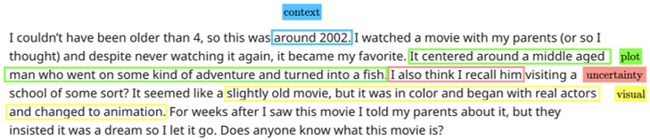

---
# Feel free to add content and custom Front Matter to this file.
# To modify the layout, see https://jekyllrb.com/docs/themes/#overriding-theme-defaults

layout: default
---

# Overview

Have you ever tried re-finding a movie that you watched as a child but cannot remember its name? Perhaps you vaguely remember the plot or a few scenes from the movie.  You might also remember things about the context in which you watched the movie.  For example, you might remember that you watched the movie in the 1980s on television.  You also remember that the movie made you feel melancholy.  Unfortunately, none of the things you remember would enable you to re-find the movie using existing information retrieval (IR) tools.

Tip-of-the-tongue (ToT) known-item retrieval is defined as "an item identification task in which the searcher has previously experienced an item but cannot recall a reliable identifier" (i.e., "It's on the tip of my tongue...").  Current IR systems are not well-equipped to address ToT information needs.  As evidence, a wide range of community Q&A sites have emerged to help people resolve their ToT information needs with the help of other people—e.g.,
- https://www.reddit.com/r/tipofmytongue
- https://irememberthismovie.com
- https://www.watzatsong.com/en
- https://www.goodreads.com/group/show/185-what-s-the-name-of-that-book
- https://scifi.stackexchange.com/questions/tagged/story-identification

Presumably, people who post to these sites either failed to resolve their needs using existing IR tools or did not even try.  

ToT information requests (or "queries") are verbose and contain a wide-range of complex phenomena.  Importantly, such phenomena are influenced by: (1) what we  remember (i.e., long-term memory)  and (2) how we naturally convey our memories to others.  Complex phenomena include contextual memories, comparisons, mentions of uncertainty, false memories, and mentions of exclusion criteria, to name a few.  The example below shows some of these complex phenomena.

**Correct answer**: <a href="https://www.imdb.com/title/tt0058230/" target="_blank">The Incredible Mr. Limpet</a>

The TREC ToT track aims to develop IR systems that can successfully resolve ToT information needs.  Progress in this area will likely benefit other IR systems that must deal with memory assistance, such as personal information management (PIM) systems (e.g., email re-finding).

The 2023 TREC ToT Track will focus on movie identification—a task that is broadly relatable and has been the focus of recent research.

## Motivations and challenges

**Beyond keyword search.** ToT queries are natural-language, verbose, and complex requiring a deeper understanding of language and contextual information and potentially more complicated search strategies including multi-hop reasoning.

**Handling inaccuracies.** Searchers in ToT states frequently express uncertainty and suffer from False memories.

**Futuristic.** Novel task. Emergent search interfaces, such as conversational search, may make it easier to express such information needs in the near-future.

# Organizers

  

    
  

  

    <b>Jaime Arguello</b>
     University of North Carolina
     Chapel Hill, North Carolina, USA
    

        
    

  

  

    
  

  

    <b>Samarth Bhargav</b>
     University of Amsterdam
     Amsterdam, The Netherlands
    

        
        &nbsp;&nbsp;&nbsp;&nbsp;
    

  

  

    
  

  

    <b>Bhaskar Mitra</b>
     Microsoft Research
     Montreal, Canada
    

        
        &nbsp;&nbsp;&nbsp;&nbsp;
        &nbsp;&nbsp;&nbsp;&nbsp;
    

  

  

    
  

  

    <b>Fernando Diaz</b>
     Google
     Montreal, Canada
    

        
        &nbsp;&nbsp;&nbsp;&nbsp;
        &nbsp;&nbsp;&nbsp;&nbsp;
    

  

  

    
  

  

    <b>Evangelos Kanoulas</b>
     University of Amsterdam
     Amsterdam, The Netherlands
    

        
        &nbsp;&nbsp;&nbsp;&nbsp;
        &nbsp;&nbsp;&nbsp;&nbsp;
    

  

